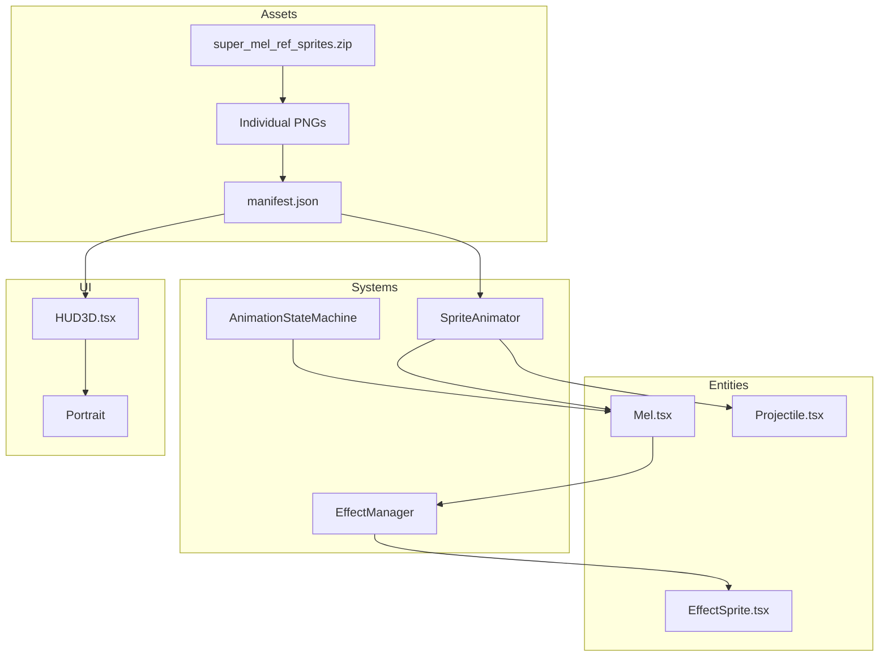

# F23-T08 — Diagramas e Documentacao

**Wave:** 4
**Type:** docs
**Depends on:** F23-T04, F23-T05, F23-T06, F23-T07
**Status:** planned

## User Story

As a developer, I want up-to-date architecture and state machine diagrams, so that the animation system is well-documented for future maintenance.

## Objective

Criar diagramas Mermaid para a F23 e atualizar o README do projeto.

## Dev Notes

Veja `_brief/00-overview.md`.

- Diagramas vao em `docs/diagrams/`
- Templates em `docs/diagrams/templates/`
- README.md do projeto deve ser atualizado com nota sobre a F23

### Arquivos a criar/modificar

- `docs/diagrams/F23-architecture.mmd` — novo
- `docs/diagrams/F23-journey.mmd` — novo
- `README.md` — atualizar

## Implementation Details

### F23-architecture.mmd

### F23-journey.mmd

State machine diagram mostrando todas as transicoes de animacao da Mel (baseado no plano secao 3).

### README.md

Adicionar em "What's New" ou secao equivalente:
> **F23 — Sprites & Animation System**: Novos sprites 2D de alta qualidade, maquina de estados de animacao completa, efeitos visuais (poeira, estrelas, coracoes), bark wave animado, e portrait no HUD.

## Acceptance Criteria

- [ ] `docs/diagrams/F23-architecture.mmd` existe e renderiza corretamente
- [ ] `docs/diagrams/F23-journey.mmd` existe e cobre todos os estados
- [ ] `README.md` atualizado com descricao da F23
- [ ] Diagramas refletem a implementacao real (nao o plano)

## Testing

Validar que os diagramas renderizam no GitHub/VS Code Mermaid preview.

## Test Scenarios

- Happy path: diagramas renderizam sem erros de sintaxe
- Edge case: README ja tem secao de features → append, nao overwrite

## Diagrams

Esta task e a dona dos diagramas:
- `docs/diagrams/F23-architecture.mmd`
- `docs/diagrams/F23-journey.mmd`
