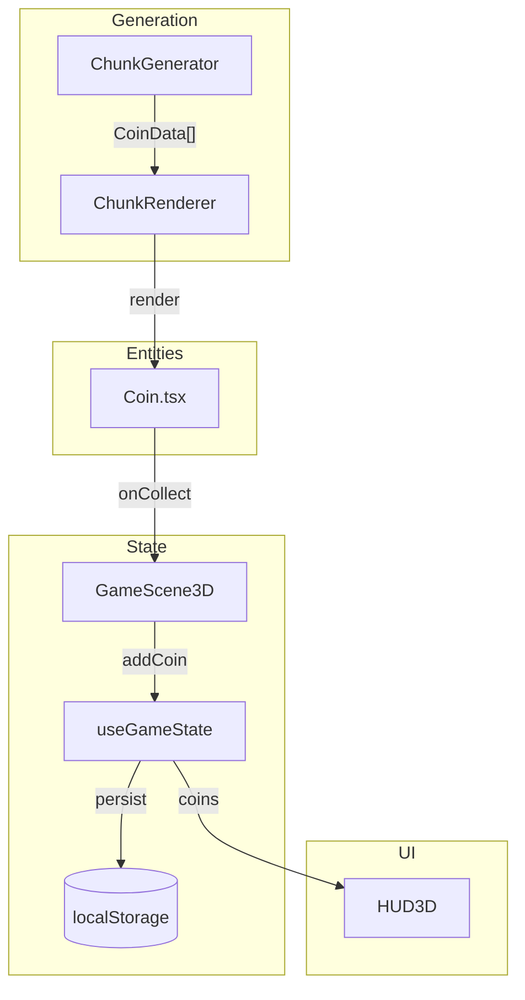
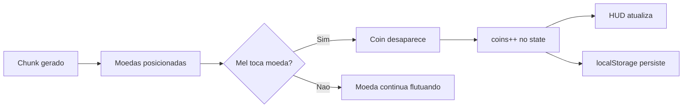

# F24-T06 — Diagramas e Documentacao

**Wave:** 3
**Type:** docs
**Depends on:** F24-T05
**Status:** planned

## User Story

As a developer, I want up-to-date diagrams documenting the coin system, so that the architecture is clear for future upgrade features.

## Objective

Criar diagramas Mermaid e atualizar README.

## Dev Notes

### Arquivos a criar/modificar

- `docs/diagrams/F24-architecture.mmd` — data flow: Coin spawn → coleta → state → HUD → localStorage
- `docs/diagrams/F24-journey.mmd` — user journey: jogador ve moeda → coleta → HUD atualiza → persiste
- `README.md` — adicionar nota sobre F24

## Implementation Details

### F24-architecture.mmd

### F24-journey.mmd

## Acceptance Criteria

- [ ] Diagramas renderizam sem erros
- [ ] README atualizado com F24

## Testing

Validar sintaxe Mermaid.

## Test Scenarios

- Happy path: diagramas renderizam no GitHub/VS Code

## Diagrams

Esta task e dona de:
- `docs/diagrams/F24-architecture.mmd`
- `docs/diagrams/F24-journey.mmd`
