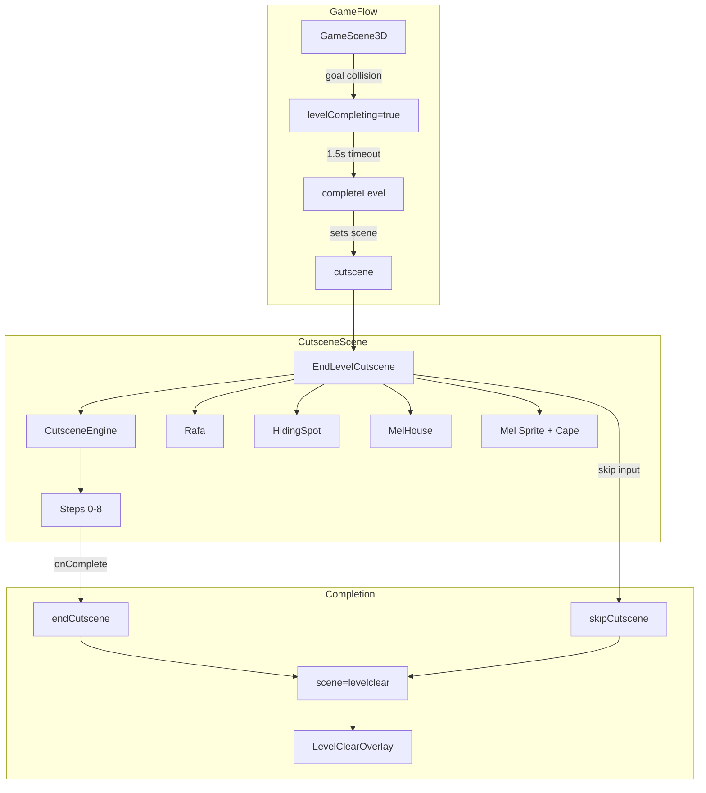
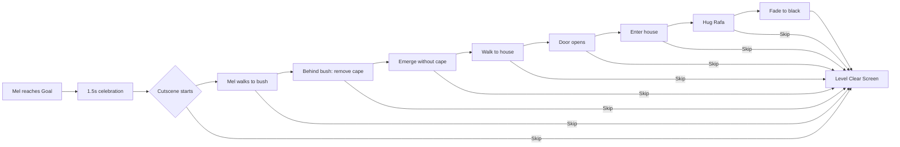

# Task F54-T07 -- Integration, Game3D Wiring, Diagrams, Documentation

**Feature:** F54
**Wave:** 3
**Type:** frontend / integration + docs
**Depends on:** T05 (useGameState cutscene flow), T06 (EndLevelCutscene scene)
**Status:** planned

## User Story

As a player, I want the cutscene to be seamlessly integrated into the game flow so that completing a level in any mode (campaign, editor test, custom level) triggers the ceremony and then transitions to the result screen.

## Objective

Wire the `EndLevelCutscene` component into `Game3D.tsx`, handle cutscene completion/skip callbacks, update audio, create architecture and journey diagrams, and update project documentation.

## Dev Notes

### 1. Wire EndLevelCutscene into Game3D.tsx

In `packages/frontend/src/game/Game3D.tsx`, add the cutscene rendering:

```typescript
import { EndLevelCutscene } from "./scenes/EndLevelCutscene";

// Inside the overlay container (alongside gameover, levelclear, etc.):
{scene === "cutscene" && cutsceneType === "end_level" && (
  <EndLevelCutscene
    onComplete={() => endCutscene()}
    onSkip={() => skipCutscene()}
  />
)}
```

Wait -- the cutscene needs to render INSIDE the Canvas (it is a 3D scene with R3F components), not in the HTML overlay. So:

**Approach:** The `EndLevelCutscene` component should be rendered inside `SceneContent` (which is inside the Canvas), similar to how `GameScene3D` and `MenuScene3D` are rendered:

```typescript
// In SceneContent:
{scene === "cutscene" && <CutsceneContent />}

// CutsceneContent wraps EndLevelCutscene with its own camera and lighting
function CutsceneContent() {
  const cutsceneType = useGameState((s) => s.cutsceneType);
  const endCutscene = useGameState((s) => s.endCutscene);
  const skipCutscene = useGameState((s) => s.skipCutscene);

  if (cutsceneType !== "end_level") return null;

  return (
    <EndLevelCutscene
      onComplete={endCutscene}
      onSkip={skipCutscene}
    />
  );
}
```

Additionally, the HTML overlay for the skip hint and fade-out needs to be rendered outside the Canvas. Add it in the overlay container:

```typescript
{scene === "cutscene" && (
  <CutsceneOverlay />  // skip hint + fade-out div
)}
```

The `CutsceneOverlay` is a simple HTML div with:
- "Pressione para pular" text (appears after 1s)
- Fade-to-black div (animated by the cutscene engine's step 8)

Communication between the R3F cutscene and the HTML overlay can use a shared ref or a small Zustand store field (e.g., `cutsceneFadeProgress: number` in useGameState).

### 2. Audio During Cutscene

In the `useEffect` that handles audio based on scene, add the cutscene case:

```typescript
} else if (scene === "cutscene") {
  playTrack("maintheme", true);  // calm home theme during cutscene
}
```

The maintheme is appropriate for the "returning home" mood. A dedicated cutscene track could be added later.

### 3. Ensure Physics Doesn't Break

The cutscene scene renders inside the `<Physics>` wrapper. Since the cutscene components (Rafa, HidingSpot, MelHouse) have NO physics bodies, Physics is effectively idle. Verify this does not cause errors.

If the physics world tries to step with no bodies and causes issues, the cutscene can be rendered with `Physics paused={true}`:

Check: in `Game3D.tsx`, the Physics component already has `paused={paused}`. We may need to also pause physics when `scene === "cutscene"`:

```typescript
<Physics
  gravity={[0, -15, 0]}
  paused={paused || scene === "cutscene"}
  timeStep={physicsTimeStep}
>
```

### 4. Handle Edge Cases

- **Editor test levels:** When a level played from the editor is completed, the cutscene should still play. The "VOLTAR AO EDITOR" button appears on the result screen after the cutscene.
- **Campaign levels:** Campaign levels use `startCampaignLevel`. The cutscene plays the same way. The "PROXIMA FASE" button appears on the result screen.
- **Daily mode:** Daily challenge levels use `gameMode === "level"` when a goal exists. The cutscene should play. If a daily challenge has no goal (infinite mode), no cutscene.
- **Infinite mode:** Never calls `completeLevel()`, so no cutscene. Verify no regression.

### 5. Create Diagrams

#### `docs/diagrams/F54-architecture.mmd`



#### `docs/diagrams/F54-journey.mmd`



### 6. Update README.md

Add a note in the "Features Entregues" section:

```markdown
### F54: Identidade Secreta da Mel (End-of-Level Ceremony)
Cutscene cinematica ao final de cada fase: Mel volta para casa, esconde a capa
de heroina atras de uma moita, e abraca seu dono Rafa -- como o Perry o Ornitorrinco.
A cutscene e pulavel (qualquer tecla/toque apos 1s). Sistema generico de cutscene
reutilizavel (CutsceneEngine). Personagem novo: Rafa (dono da Mel).
```

### 7. Update docs/README.md Index

Add entries for F54 diagrams and any new docs.

### Relevant Files

- `packages/frontend/src/game/Game3D.tsx` -- primary integration point
- `packages/frontend/src/game/scenes/EndLevelCutscene.tsx` (T06) -- the cutscene component
- `packages/frontend/src/game/hooks/useGameState.ts` (T05) -- cutscene state
- `docs/diagrams/` -- new diagram files
- `README.md` -- project README update

### Gotchas

- The cutscene is a 3D R3F scene, so it must be rendered inside `<Canvas><Physics>`. The HTML overlay (skip hint, fade) must be rendered outside the Canvas.
- Physics should be paused during the cutscene to avoid unnecessary computation.
- The `endCutscene`/`skipCutscene` actions are already defined in T05. This task only calls them.
- Camera management: the cutscene uses its own `PerspectiveCamera makeDefault`. When the cutscene ends and scene changes to "levelclear", the camera setup from `SceneContent` takes over again. Verify no camera conflicts.
- The cutscene replaces the existing "playing" scene content. When scene = "cutscene", `GameScene3D` does NOT render (it only renders when scene = "playing").

## Testing

- Manual: Complete a campaign level -- verify: gameplay -> 1.5s celebration -> cutscene plays -> result screen
- Manual: Complete an editor test level -- verify same flow, then "VOLTAR AO EDITOR" works
- Manual: Play infinite mode -- verify no cutscene, game over works normally
- Manual: Complete a level and skip the cutscene -- verify direct transition to result screen
- Manual: Verify audio plays maintheme during cutscene
- Manual: Verify physics is paused during cutscene (no console warnings)
- Manual: Verify camera switches cleanly between gameplay and cutscene
- Manual: Verify diagrams render correctly (paste into mermaid live editor)
- Manual: Verify README.md has the F54 note

## Acceptance Criteria

- [ ] `EndLevelCutscene` rendered inside `SceneContent` when `scene === "cutscene"`
- [ ] `CutsceneOverlay` (skip hint + fade) rendered in HTML overlay when `scene === "cutscene"`
- [ ] `endCutscene()` called on natural cutscene completion -> transitions to levelclear
- [ ] `skipCutscene()` called on player skip input -> transitions to levelclear
- [ ] Audio plays maintheme during cutscene
- [ ] Physics paused during cutscene scene
- [ ] Campaign levels: cutscene plays, then "PROXIMA FASE" button works
- [ ] Editor test levels: cutscene plays, then "VOLTAR AO EDITOR" button works
- [ ] Infinite mode: no cutscene, no regression
- [ ] Daily challenge with goal: cutscene plays
- [ ] `docs/diagrams/F54-architecture.mmd` created
- [ ] `docs/diagrams/F54-journey.mmd` created
- [ ] `README.md` updated with F54 feature note
- [ ] `docs/README.md` index updated
- [ ] No camera conflicts between cutscene and gameplay
- [ ] TypeScript compiles without errors
- [ ] No regressions in any existing game mode

## Test Scenarios

- **Campaign flow:** Campaign level -> goal -> celebration -> cutscene -> result -> next level
- **Editor test flow:** Editor play -> goal -> celebration -> cutscene -> result -> back to editor
- **Skip flow:** Any level -> goal -> celebration -> cutscene starts -> skip -> result
- **Infinite mode:** No goal, no cutscene, game over works
- **Daily with goal:** Daily challenge -> goal -> cutscene -> result
- **Menu return:** From result screen -> menu -> start new game -> no cutscene artifacts
