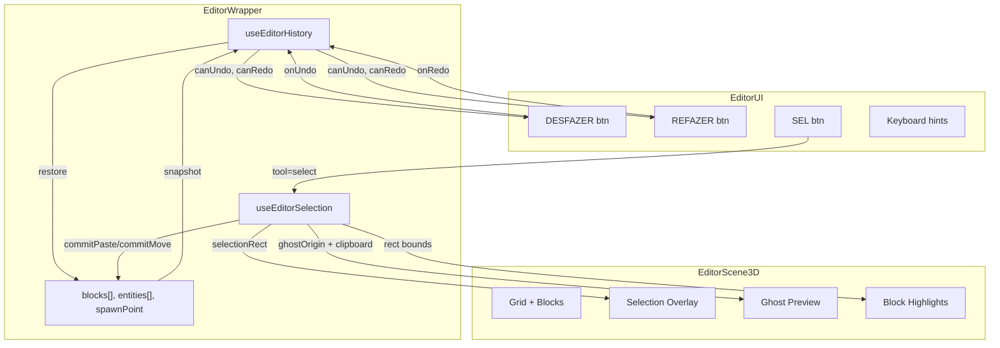

# Task F57-T08 -- Diagrams + Documentation Update

**Feature:** F57
**Wave:** 3
**Type:** docs
**Depends on:** F57-T06 (copy/paste), F57-T07 (drag-move) -- all implementation tasks
**Status:** planned

## User Story

As a developer or reviewer, I want up-to-date architecture diagrams and documentation for the editor QoL features so that I can understand the data flow, hook relationships, and user interaction model.

## Objective

Create Mermaid architecture and user journey diagrams for F57. Update the project README.md with a note about the feature. Update docs/README.md index if new docs were created.

## Dev Notes

### 1. Create `docs/diagrams/F57-architecture.mmd`

Architecture diagram showing:
- `EditorWrapper` as the orchestrator component
- `useEditorHistory` hook with undo/redo stacks
- `useEditorSelection` hook with selection rect, clipboard, modes
- `EditorScene3D` receiving selection and ghost data as props
- `EditorUI` receiving undo/redo state and selection tool
- Data flow: user action -> pushSnapshot -> state mutation -> render
- Data flow: undo -> restore snapshot -> state update -> render
- Data flow: select -> drag -> updateRect -> render overlay
- Data flow: copy -> clipboard -> paste -> ghost -> commit -> merge



### 2. Create `docs/diagrams/F57-journey.mmd`

User journey diagram showing the key interaction flows:

1. **Undo/Redo flow:** Place block -> Ctrl+Z (undo) -> block removed -> Ctrl+Shift+Z (redo) -> block back
2. **Select + Copy/Paste flow:** Click SEL -> drag rectangle -> Ctrl+C -> move cursor -> Ctrl+V -> ghost preview -> click to place
3. **Select + Delete flow:** Click SEL -> drag rectangle -> Delete -> confirmation (if >20) -> blocks removed
4. **Select + Move flow:** Click SEL -> drag rectangle -> drag inside rectangle -> ghost preview -> release -> blocks moved
5. **Cancel flow:** Any mode -> Escape -> return to idle

### 3. Update `README.md`

Add entry to the "Features Entregues" section:

```markdown
- **F57: Editor QoL** -- Undo/redo (Ctrl+Z/Ctrl+Shift+Z, 50-snapshot stack),
  rectangular selection tool (SEL), copy/paste (Ctrl+C/Ctrl+V with ghost preview),
  delete selection (Delete key), drag-move selection. Keyboard shortcuts with
  input-field guard.
```

### 4. Update `docs/README.md` index

Add entries for the new diagrams:
```markdown
- [F57 Architecture](diagrams/F57-architecture.mmd) -- Editor QoL hooks and data flow
- [F57 User Journey](diagrams/F57-journey.mmd) -- Undo/redo, select, copy/paste, move flows
```

### 5. Update MEMORY.md context (if applicable)

Update the editor-related sections in project memory to note the new capabilities.

### Relevant Existing Files

- `docs/diagrams/` -- existing diagram files to reference for format
- `README.md` -- project README with Features Entregues section
- `docs/README.md` -- docs index

### Gotchas

- Diagrams must be valid Mermaid syntax (test in a Mermaid live editor or renderer).
- Do not overwrite existing content in README.md -- append to the appropriate section.
- The architecture diagram should clearly show the two new hooks as the core abstractions.
- The journey diagram should cover all 5 main user flows (undo, redo, select, copy/paste, move, delete).

## Testing

- Manual: Open F57-architecture.mmd in a Mermaid renderer -- renders without syntax errors.
- Manual: Open F57-journey.mmd in a Mermaid renderer -- renders without syntax errors.
- Manual: Check README.md has the F57 entry.
- Manual: Check docs/README.md has the new diagram links.

## Acceptance Criteria

- [ ] `docs/diagrams/F57-architecture.mmd` created with valid Mermaid syntax
- [ ] Architecture diagram shows useEditorHistory, useEditorSelection, EditorWrapper, EditorScene3D, EditorUI relationships
- [ ] `docs/diagrams/F57-journey.mmd` created with valid Mermaid syntax
- [ ] Journey diagram covers undo/redo, select, copy/paste, move, delete flows
- [ ] `README.md` updated with F57 feature note in Features Entregues section
- [ ] `docs/README.md` index updated with links to new diagrams
- [ ] All Mermaid diagrams render without errors
- [ ] No existing content overwritten or removed

## Test Scenarios

- **Architecture diagram:** Renders in Mermaid Live Editor without errors
- **Journey diagram:** Renders in Mermaid Live Editor without errors
- **README check:** F57 entry visible in Features Entregues
- **Docs index check:** F57 diagram links present and correct
